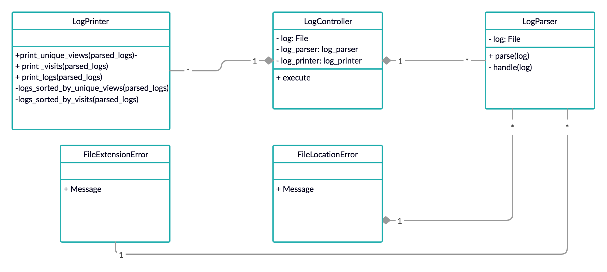

# Smart Ruby App


## Table of Contents
* [Code Quality](#code-quality)
* [Technologies](#technologies)
* [Getting Started](#getting-started)
* [Testing](#testing)
* [Domain Model](#domain-model)
* [Principles and takeaways](#principles-and-takeaways)
* [Analysis](#analysis)
* [Author](#author)

## Code Quality
[](https://codeclimate.com/github/xelAhcratiPsavilO/smart_ruby_app/maintainability)
- Test Coverage 100%. Consult coverage:
```bash
open coverage
```
Then double click to open index.html on browser.

## Technologies
- Main technology
  - [Ruby](https://www.ruby-lang.org/en/) - High-level, general-purpose language utilized as main technology.
- Unit Test
  - [RSpec](https://rspec.info/) - Domain specific language utilized as testing tool.
- Feature Test
  - [IRB](https://en.wikipedia.org/wiki/Interactive_Ruby_Shell) - Interactive ruby shell utilized as a REPL.
- Documentation
  - [MD](https://www.markdownguide.org/) - Lightweight markup language utilized for documentation.

## Getting Started
Follow the instructions below to clone the repository and run it locally for testing and development demonstrations.

### Prerequisites
- Verify that a current version of Ruby is installed:
```bash
ruby -v
```

### Installing
- Clone the repository:
```bash
git clone git@github.com:xelAhcratiPsavilO/smart_ruby_app.git
```
- Install dependencies listed in the Gemfile:
```bash
bundle install
```
- Launch irb, pry or other ruby REPL:
```bash
irb
```

### Running
- Launch system script:
```bash
./parser.rb webserver.log
```

## Testing
- Launch RSpec to verify that all tests are passing:
```bash
rspec
```
- Expected output:
```bash
FileLocationError
  #message
    displays a customize error message
FileExtensionError
  #message
    displays a customize error message
LogController
  #execute
    parses and prints logs
LogParser
  #initialize
    when the file does not exist in the given path
      raises an error
    when the file extension is not LOG
      raises an error
    when the file exists and the extension is LOG
      does not raise an error
  #parsed_logs
    when the file is parsed
      stores the logs in a hash
LogPrinter
  #print_visits
    when the logs are stored
      prints a list of visits per endpoint
  #print_unique_views
    when the logs are stored
      prints a list of unique views per endpoint
  #print_logs
    when the logs are stored
      prints a list of visits per endpoint and a list of unique views per endpoint
Finished in 0.0388 seconds (files took 1.13 seconds to load)
10 examples, 0 failures
Coverage report generated for RSpec to /Users/username/Desktop/smart-app-ruby/coverage. 114 / 114 LOC (100.0%) covered.
```

## Domain Model
High-level overview of the entities that make up this functional system.



Based on [client's requirements](INSTRUCTIONS.md).

## Principles and takeaways
A maintainable design and seamless integration allows the extraction and encapsulation of responsibilities into several classes.
Abstraction and privatization of methods and properties hides complexity creating simpler interfaces and reducing the impact of change.
Doubling objects and stubbing behaviors allows to test units in isolation.
Dependency injection looses the coupling between objects, making the system more flexible, scalable and testable.

## Analysis
There is room for improvement around abstraction and encapsulation. On the one hand, some work has been done in that direction as the size of the LogParser indicated that it was the perfect candidate for separation or responsibilities (SRP, single responsibility principle). On the other hand, the obvious similarities between the print_visits method and the print_unique_views method makes them candidates for some OOP housekeeping. However, it has been chosen to favor simplicity and readability in detriment of scalability. It is worth mentioning that, a hypothetical appearance of a third way or printing would have inclined me for a refactor, extracting the printers to classes that include a common module as mixing (see [this project](https://github.com/xelAhcratiPsavilO/city_bikes) as example).

## Author
Alejandro Pitarch Olivas
